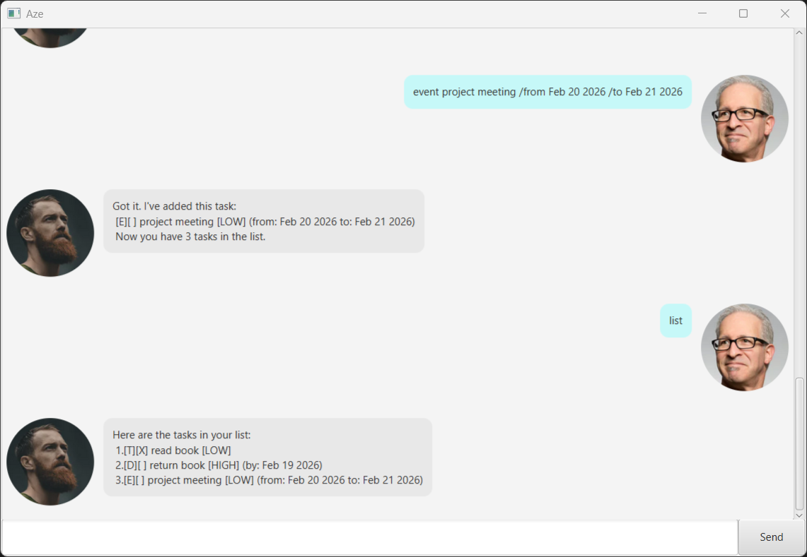

# Aze User Guide

Aze is a desktop app for managing tasks, optimized for use via a Command Line Interface (CLI) while still having the benefits of a Graphical User Interface (GUI). If you can type fast, Aze can get your task management done faster than traditional GUI apps.



## Quick Start

1. Ensure you have Java 17 installed on your computer.

2. Download the latest `.jar`.

3. Copy the file to the folder you want to use as the home folder for Aze.

4. Open a command terminal, `cd` into the folder you put the jar file in, and use the `java -jar aze.jar` command to run the application.

5. Type your command in the text box at the bottom and press Enter to execute it.

6. Refer to the [Features](#features) section below for details of each command.

---

## Features

> **Notes about the command format:**
> - Words in `UPPER_CASE` are parameters to be supplied by you.
>   - e.g. in `todo DESCRIPTION`, `DESCRIPTION` is a parameter which can be used as `todo read book`.
> - Task numbers refer to the index shown in the task list (starting from 1).
> - Date formats should follow `YYYY-MM-DD` (e.g., `2026-02-19`).

### Viewing all tasks: `list`

Shows a list of all tasks in your task list.

**Format:** `list`

**Example:**
```
list
```

**Expected output:**
```
Here are the tasks in your list:
 1.[T][ ] buy groceries [LOW]
 2.[D][X] submit assignment /by: Mar 15 2026 [HIGH]
 3.[E][ ] team meeting /from: 2pm /to: 4pm [MEDIUM]
```

---

### Adding a todo: `todo`

Adds a simple todo task to your task list.

**Format:** `todo DESCRIPTION`

**Example:**
```
todo read book
```

**Expected output:**
```
Got it. I've added this task:
 [T][ ] read book [LOW]
 Now you have 4 tasks in the list.
```

---

### Adding a deadline: `deadline`

Adds a task with a specific deadline to your task list.

**Format:** `deadline DESCRIPTION /by DATE`

- `DATE` should be in `YYYY-MM-DD` format.

**Example:**
```
deadline submit report /by 2026-03-20
```

**Expected output:**
```
Got it. I've added this task:
 [D][ ] submit report /by: Mar 20 2026 [LOW]
 Now you have 5 tasks in the list.
```

---

### Adding an event: `event`

Adds an event with a start and end time to your task list.

**Format:** `event DESCRIPTION /from START /to END`

- `START` and `END` can be in any time format you prefer.

**Example:**
```
event project meeting /from 2026-03-15 2pm /to 2026-03-15 4pm
```

**Expected output:**
```
Got it. I've added this task:
 [E][ ] project meeting /from: 2026-03-15 2pm /to: 2026-03-15 4pm [LOW]
 Now you have 6 tasks in the list.
```

---

### Marking a task as done: `mark`

Marks a specific task as completed.

**Format:** `mark INDEX`

- `INDEX` must be a valid task number from your list.

**Example:**
```
mark 2
```

**Expected output:**
```
Nice! I've marked this task as done:
 [D][X] submit assignment /by: Mar 15 2026 [HIGH]
```

---

### Marking a task as not done: `unmark`

Marks a completed task as not done yet.

**Format:** `unmark INDEX`

- `INDEX` must be a valid task number from your list.

**Example:**
```
unmark 2
```

**Expected output:**
```
OK, I've marked this task as not done yet:
 [D][ ] submit assignment /by: Mar 15 2026 [HIGH]
```

---

### Setting task priority: `priority`

Sets the priority level of a task.

**Format:** `priority INDEX PRIORITY_LEVEL`

- `INDEX` must be a valid task number from your list.
- `PRIORITY_LEVEL` must be one of: `low`, `medium`, `high` (case-insensitive).

**Example:**
```
priority 1 high
```

**Expected output:**
```
Got it. I've updated the priority of this task:
 [T][ ] buy groceries [HIGH]
```

---

### Finding tasks: `find`

Finds all tasks that contain a specific keyword in their description.

**Format:** `find KEYWORD`

**Example:**
```
find meeting
```

**Expected output:**
```
Here are the matching tasks in your list:
 1.[E][ ] team meeting /from: 2pm /to: 4pm [MEDIUM]
 2.[E][ ] project meeting /from: 2026-03-15 2pm /to: 2026-03-15 4pm [LOW]
```

---

### Deleting a task: `delete`

Deletes a task from your task list.

**Format:** `delete INDEX`

- `INDEX` must be a valid task number from your list.

**Example:**
```
delete 3
```

**Expected output:**
```
Noted. I've removed this task:
 [E][ ] team meeting /from: 2pm /to: 4pm [MEDIUM]
 Now you have 5 tasks in the list.
```

---

### Exiting the program: `bye`

Exits the program.

**Format:** `bye`

---

## Command Summary

| Action | Format | Example |
|--------|--------|---------|
| **List all tasks** | `list` | `list` |
| **Add todo** | `todo DESCRIPTION` | `todo read book` |
| **Add deadline** | `deadline DESCRIPTION /by DATE` | `deadline submit report /by 2026-03-20` |
| **Add event** | `event DESCRIPTION /from START /to END` | `event meeting /from 2pm /to 4pm` |
| **Mark as done** | `mark INDEX` | `mark 2` |
| **Mark as not done** | `unmark INDEX` | `unmark 2` |
| **Set priority** | `priority INDEX PRIORITY_LEVEL` | `priority 1 high` |
| **Find tasks** | `find KEYWORD` | `find meeting` |
| **Delete task** | `delete INDEX` | `delete 3` |
| **Exit** | `bye` | `bye` |

---

## FAQ

**Q: How do I transfer my data to another computer?**

A: Copy the `data/tasks.txt` file to the same folder where you place `aze.jar` in the other computer.